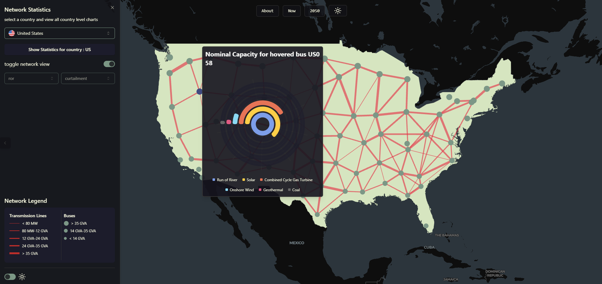
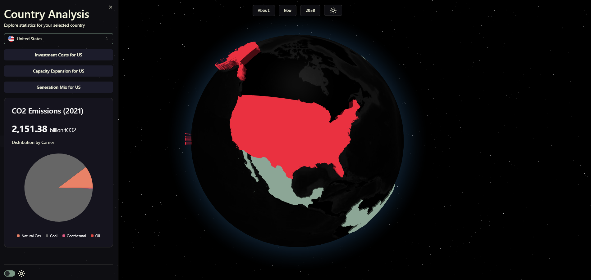

# PyPSA-Earth Visualization Dashboard

This repository houses a dashboard designed to visualize the model output of PyPSA-Earth. The dashboard provides insights into energy models and helps understand current energy networks and future scenarios.

## Data Sources

The visualizations in this dashboard are powered by data processed using scripts from the [jis-validation-repo](https://github.com/open-energy-transition/ji-gis-validation). You can reproduce the database using these scripts. A sample .env file is provided in the repository to help you get started.

## Getting Started

To run the development server locally:

```bash
npm run dev
```

## Main Sections

### Home Page

The landing page of the dashboard providing an overview of the project and navigation to different sections.

### Now Page

This section visualizes the current state of the energy network and highlights key insights that can be drawn from the existing infrastructure.



### 2050 Page

Here we showcase the model's capability to estimate future energy scenarios based on given parameters. The visualizations help in understanding potential future states and transitions in energy systems.



### Learn More Page

Coming soon! This section will provide more in-depth information about the models and methodologies.

## Contributors

<a href="https://github.com/BryanFran"></a>
<a href="https://github.com/drifter089"></a>
<a href="https://github.com/GbotemiB"></a>
<a href="https://github.com/ekatef"></a>
<a href="https://github.com/yerbol-akhmetov"></a>
<a href="https://github.com/ElectricMountains"></a>
<a href="https://github.com/davide-f"></a>

## Building and Deployment

To build the application for production:

```bash
npm run build
```

## Learn More

For more information about PyPSA-Earth:

- [PyPSA-Earth GitHub](https://github.com/pypsa-meets-earth/pypsa-earth)
- [PyPSA Github](https://github.com/PyPSA/PyPSA)
